# runControl
An app that collects information about running workouts.

Permission fragment:  
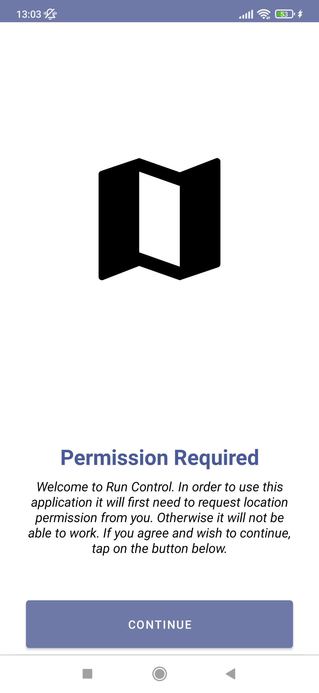

Map fragment, notification and result fragment:  
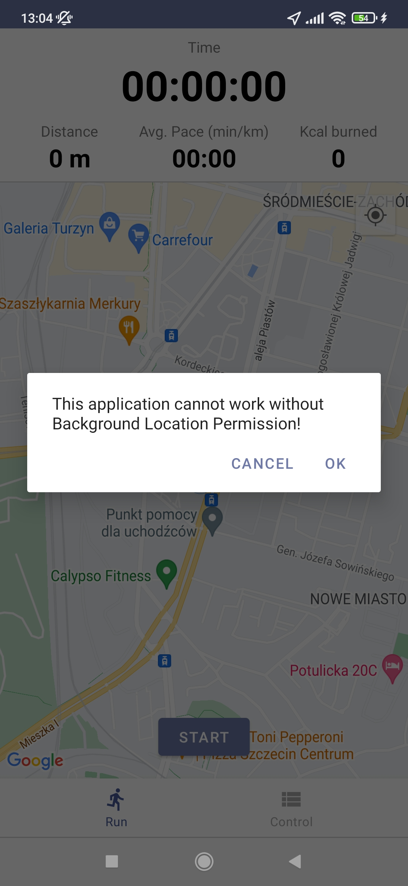
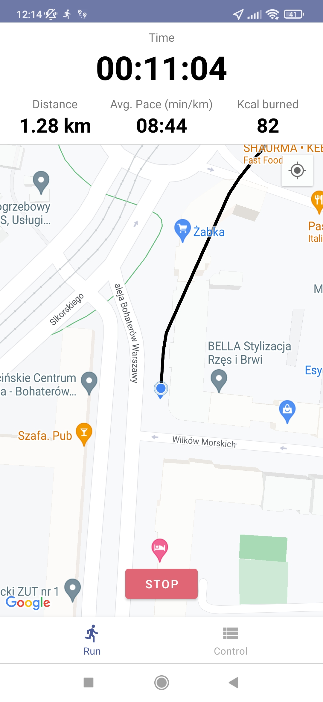
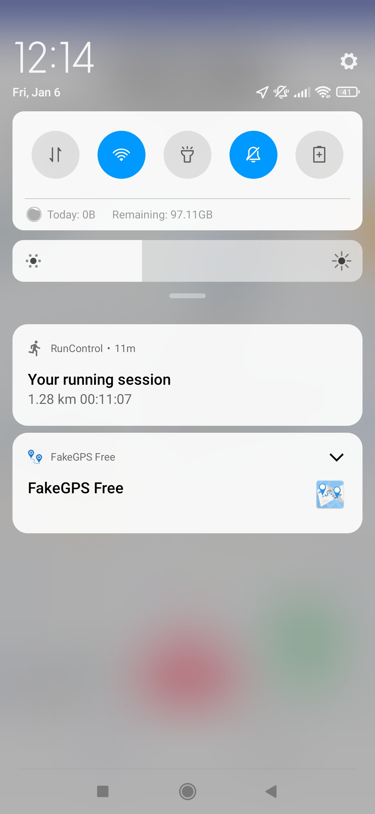
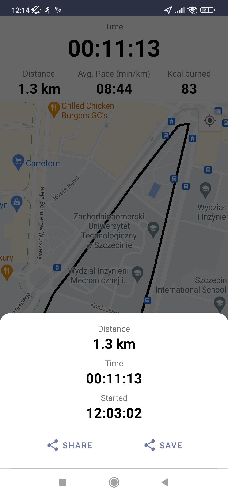
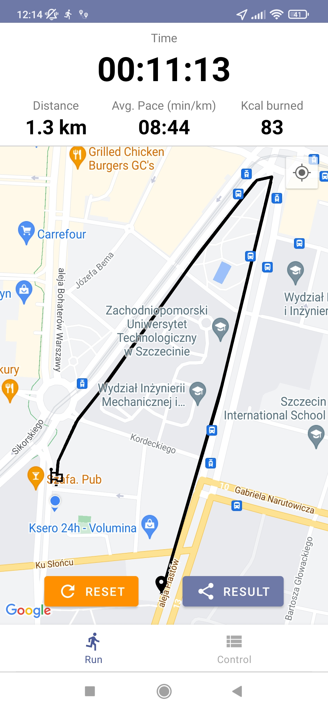

Control fragment:  
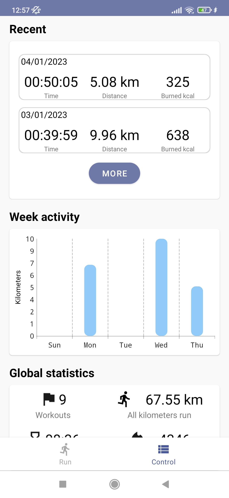
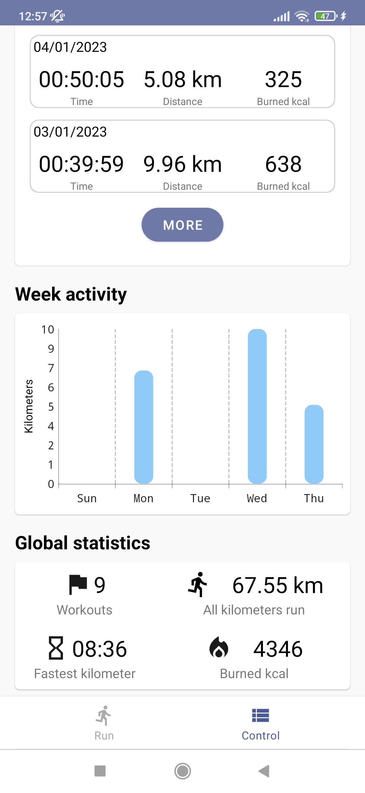
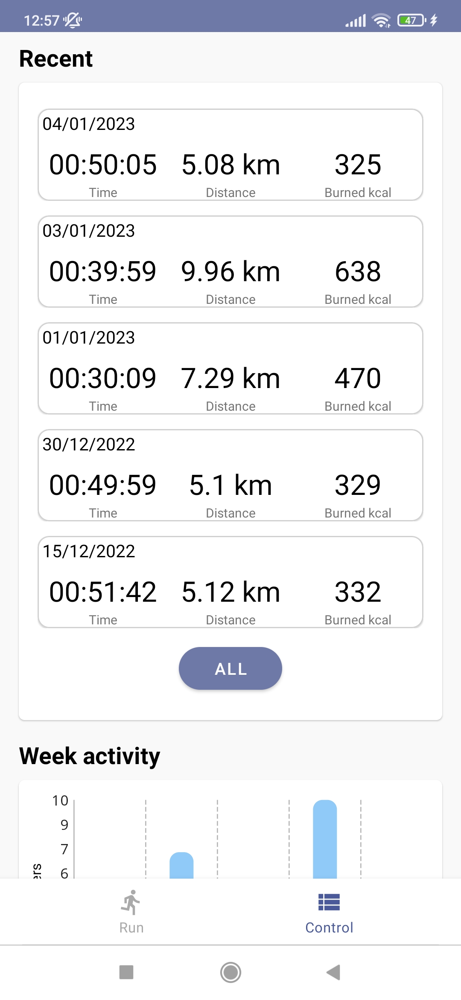

History fragment:  
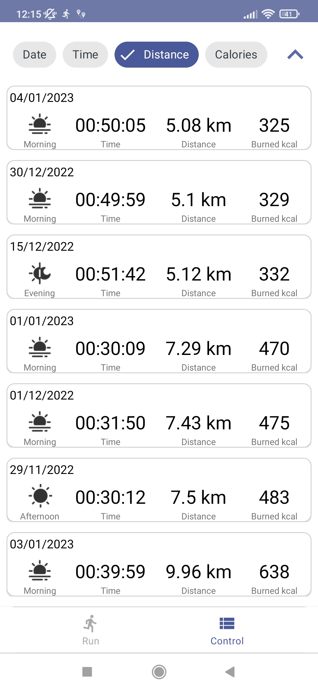

Details fragment:  
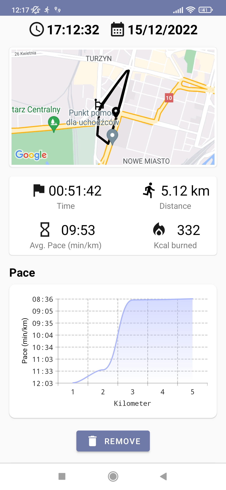

